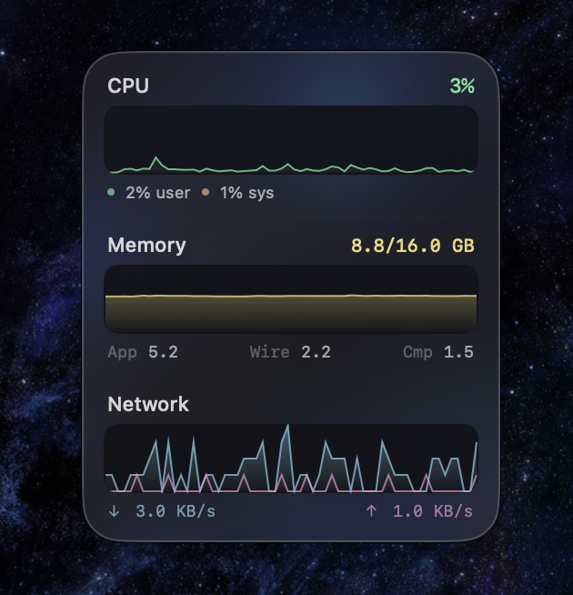

# SystemWidget



macOS Tahoe system monitor widget with liquid glass. Shows CPU, memory, and network with live graphs.

```
bash build.sh
open SystemWidget.app
```

Right-click to float above windows or quit. Click to open Activity Monitor.
